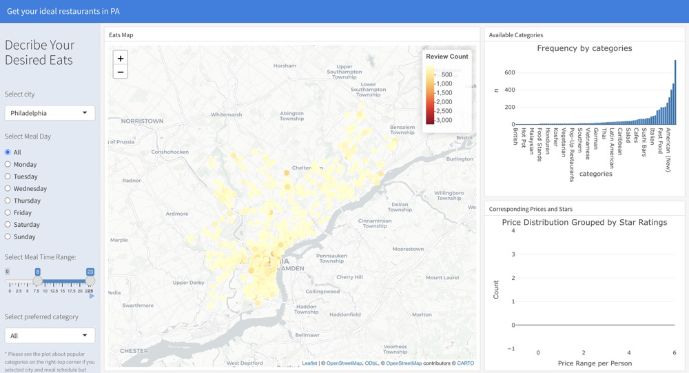

```{r setup, include=FALSE}
knitr::opts_chunk$set(
  echo = TRUE,    
  warning = FALSE,
  message = FALSE   
)

```

```{r load-packages, message=FALSE, warning=FALSE}

library(dplyr)
library(ggplot2)
library(tigris)
library(tidyr)
library(janitor)
library(plotly)
library(sf)
library(broom)
load("data/PAhour.rdata")
load("data/mergedPA.RData")
```

Group members:  
  - Yutong Chen (yc4617)   
  - Tingcheng Pan (tp2859)    
  - Shiying Wu (sw3455)   
  - Yifan Xu (yx2857)  

## **Motivation**
The aim of our project is to explore the relationship between restaurant pricing and customer ratings, and its reflection on the food culture and economic diversity of the city. Understanding the correlation between restaurant pricing and customer ratings has become critical as consumers demand more in terms of dietary choices and quality of life. We plan to analyze regional restaurant data to reveal potential patterns between price ranges and customer ratings, thereby providing the restaurant industry with a reference point for optimizing pricing and service enhancement.

## **Related Work**
We are inspired by a large body of research on the relationship between consumer behavior and commercial pricing. For example, certain studies suggest that high pricing may imply high quality, but in practice, consumer ratings may focus more on service experience and dining quality than on price. These studies emphasize the importance of analyzing price in conjunction with reviews. By integrating data from platforms such as Yelp, our project attempts to systematically analyze the relationship between price ranges and ratings of restaurants in the region, further enriching research in this area.


## **Initial Questions**
The purpose of this project is to answer the following question:

- Is there a significant correlation between a restaurant's price range and customer ratings?

- Can we reveal patterns in the cultural and economic diversity of urban food from price and rating datasets?

- Through visualization and interactive tools, how can we help users quickly understand the distribution of prices and ratings of restaurants in different areas and choose the most compatible restaurant?

## **Data**
### **Source**
  The data for this project was obtained from [Yelp's Open Dataset](https://www.yelp.com/dataset) as JSON files which contain `150,346` stores including diverse types of shops and restaurants. Yelp provides detailed `58` variables on businesses, including restaurants, their locations, ratings, reviews, and various attributes like dog allows and price range. While the dataset does not include New York data, it provides comprehensive coverage of other regions, including PA.

### **Scraping Method**
  Initially, we planned to use the Yelp Fusion API to retrieve data, as it allows access to Yelp’s business information programmatically. However, the detailed datasets and larger limits we required were cost-prohibitive. Instead, we used the [Yelp's Open Dataset](https://www.yelp.com/dataset). While this dataset did not include New York data, we decided to focus on Southeastern Pennsylvania, a region with a large number of observations and close to where Angel’s friend lives.
As we explored the data further, we found that it included 228 cities and townships. To enhance the analysis, we narrowed the scope to counties, merging the data with county information obtained from the [United States zip codes ](https://www.unitedstateszipcodes.org/pa/). This allowed us to provide a clearer geographic perspective.

### **Data Cleaning**
The data cleaning process involved multiple steps to ensure accuracy, consistency, and relevance:

- **Removing Irrelevant Entries**:  
  Yelp’s dataset contains various types of businesses, including non-restaurant establishments. We filtered the data to focus only on restaurants and removed irrelevant categories.

- **Geographic Normalization**:  
  Standardized city and county names for consistency by lowercase, such as converting variations like "Phila" to "Philadelphia."  

- **Handling Erroneous Values**:  
  Corrected anomalies in the data, such as fixing incorrect ZIP codes (e.g., changing 10426 to 19426).

- **Filtering by Counties**:  
  To simplify analysis, we merged data based on county boundaries using ZIP code data and focused on five counties in Southeastern Pennsylvania: Philadelphia, Delaware, Montgomery, Chester, and Bucks.
  
### **Final Dataset**
The final dataset contains 7,801 observations and includes key variables such as:

- **Location Information**: `city`, `county`, `postal_code`, `longitude`, and `latitude.`
- **Restaurant Attributes**: `Star`, `review_count`, `categories`, `price range`, and additional features like `delivery` or `takeout` availability.
- **Hours of Operation**: `Everyday Hours`, `Weekday/Weekend hours`, and `Total hours`.

## **Exploratory analysis**

### **Regional analysis**
The distribution of restaurants across counties reveals notable disparities. Philadelphia, with 3,426 observations, significantly surpasses all other counties, while Berks, with just 22 restaurants, has the fewest. This stark contrast underscores differences in population density, urbanization, and possibly Yelp's data coverage. These disparities may highlight underserved areas or variations in restaurant accessibility and quality between urban and rural settings.  
  
We firstly did a basic analysis of the average rating and price range of restaurants in each county in PA. We found the counties only took a small part in the southeast of PA, and the distribution of restaurant was quite different in each county, so we plotted them in a map to display in a more straight forward way.  
  
```{r, include=FALSE}
##generate a map of PA with number of restaurants as the fill color of each county
county_restaurant_counts <- mergedPA %>%
  group_by(county) %>%
  summarize(restaurant_count = n()) %>%
  ungroup()

pa_counties <- counties(state = "PA", class = "sf")  

county_restaurant_counts <- county_restaurant_counts %>%
  mutate(county = tolower(county))

pa_counties <- pa_counties %>%
  mutate(NAME = tolower(NAME))

pa_counties_restaurants <- pa_counties %>%
  left_join(county_restaurant_counts, by = c("NAME" = "county"))


```

```{r}
ggplot(data = pa_counties_restaurants) +
  geom_sf(aes(fill = restaurant_count)) +
  scale_fill_viridis_c(option = "plasma", na.value = "grey90") +
  theme_minimal() +
  labs(
    title = "Number of Restaurants by County in Pennsylvania",
    fill = "Restaurant Count"
  )

```
  

It was quite clear that county was not a good grouping level to show the restaurant count, so we decided to use zip code as the grouping level to show the distribution of restaurant count. We found that central Philadelphia had the most restaurants, this is consistent with the popularity and the population distribution in Pennsylvania. After a few iterations, we finalized a heat map of restaurant counts by zip code in the SE PA. The map provides a clear visual representation of restaurant distribution, with Philadelphia and its surrounding areas boasting the highest concentration of dining options. This visualization can help users identify areas with more culinary offerings and guide restaurant selection based on location and availability. A plotly version was included in the website index page.   

```{r, include=FALSE}
zip_restaurant_counts <- mergedPA %>%
  group_by(postal_code, city) %>%
  summarize(restaurant_count = n(), .groups = "drop") %>%
  mutate(postal_code = as.character(postal_code)) 

# PA was only available in 2010 version
pa_zipcodes <- suppressMessages({zctas(state = "PA", class = "sf", year = 2010)}) %>%
  mutate(ZCTA5CE10 = as.character(ZCTA5CE10))  

# county boundaries
pa_counties_6 <- counties(state = "PA", class = "sf") %>%
  filter(NAME %in% c("Montgomery", "Delaware", "Chester", "Bucks", "Berks", "Philadelphia"))


filtered_zipcodes <- pa_zipcodes %>%
  semi_join(zip_restaurant_counts, by = c("ZCTA5CE10" = "postal_code"))

# Join restaurant data with the filtered zip
pa_zipcodes_restaurants <- filtered_zipcodes %>%
  left_join(zip_restaurant_counts, by = c("ZCTA5CE10" = "postal_code"))

```

```{r}
zipcode_heatmap <- ggplot(data = pa_zipcodes_restaurants) +
  geom_sf(
    aes(
      fill = restaurant_count,
      text = paste0(
        "ZIP Code: ", ZCTA5CE10,
        "\nCity: ", city,
        "\nRestaurant Count: ", restaurant_count
      )
    ),
    color = "grey10",  
    , linewidth = 0.1      
  ) +
  geom_sf(
    data = pa_counties_6,
    fill = NA, 
    color = "blue",    
    linetype = "dashed", 
    size = 0.8
  ) +
  geom_sf_text(data = pa_counties_6, aes(label = NAME), 
               size = 4, 
               fontface = "bold", 
               color = "#333333") +
  scale_fill_gradientn(
    colors = c("#ffe2df", "#FFADAD", "#FF6F61", "#ff5252", "#a70000"), 
    na.value = "grey90",  
    name = "Restaurant Count"
  ) +
  coord_sf(
    xlim = c(-76, -74.7),  
    ylim = c(39.7, 40.6),  
    expand = FALSE
  ) +
  theme_minimal() +
  labs(
    title = "Number of Restaurants by ZIP Code in Southeastern Pennsylvania",
    fill = "Restaurant Count"
  )

zipcode_heatmap
```

Another plot by location and ratings were then generated to investigate how the rated restaurants located.  
```{r, fig.width = 10, fig.asp = 0.8, warning=FALSE}
ggplot() +
  geom_sf(data = pa_counties, color = "black", fill = "lightgrey", size = 0.8) + 
  geom_point(
    data = mergedPA,
    aes(x = longitude, y = latitude, color = stars),
    size = 0.5, alpha = 0.5
  ) +  
  geom_sf_text(
    data = pa_counties,
    aes(label = NAME),
    size = 3, color = "black", fontface = "bold"
  ) +  
  coord_sf(xlim = c(-76, -74.5), ylim = c(39.7, 40.5), expand = FALSE) + 
  theme_void(base_size = 15) +
  theme(
    legend.position = "bottom",
    plot.title = element_text(hjust = 0.5, size = 16)
  ) +
  guides(color = guide_colorbar(
    title.position = "top",
    barwidth = 15,
    barheight = 0.5
  )) +
  scale_color_viridis_c(option = "D", name = "Stars") + 
  labs(
    title = "Restaurant Ratings in Southeastern Pennsylvania (By County)",
    color = "Stars"
  )
```

Interestingly, despite its small sample size, Berks County boasts the highest average restaurant rating, likely influenced by the limited data. In contrast, more populous counties, such as Philadelphia and Montgomery, exhibit stable and slightly lower average ratings. Among these, Philadelphia stands out for its consistently high scores, likely reflecting its competitive and diverse dining scene.

Price range analysis further highlights regional contrasts. By calculating the range of prices for restaurants, we found that Philadelphia and Montgomery offer the widest variety of dining options. Meanwhile, Berks County exhibits a narrow price range, underscoring its limited culinary diversity.


### **Rating analysis**

- **How does review count correlate with stars?**

Initially, we hypothesized a positive linear relationship between review count and star ratings. However, our analysis revealed otherwise—restaurants with only one review often have either very high or very low ratings, indicating extreme opinions. Filtering for restaurants with over 1,000 reviews, we found no significant correlation between review count and ratings (p-value = 0.22765). The scatterplot showed no linear trend, suggesting factors like location, popularity, or marketing may have a greater impact on review counts than ratings themselves.

- **Does the price range correlate with higher ratings?**

By grouping restaurants into price ranges ($0–$10, $11–$30, $31–$60, $61–$200) and analyzing average star ratings, we observed a positive trend: higher price ranges generally corresponded to better ratings. However, this relationship, while evident, is not absolute. Ratings are also influenced by other factors such as cuisine type, service quality, and location, highlighting that price alone does not determine restaurant quality. For instance, average stars ranged from 3.36 for the lowest price range to 3.78 for the highest.

## **Statistical Model**
### **Basic analysis**

In the third question, after examining the relationship between price and ratings, we wanted to learn more about other factors that influence restaurant popularity. This time, instead of using only the number of reviews or the star rating, we combined them and assigned different weights to the “popularity_score”. We weighted the star rating down to 0.3 and the review count to 0.7, which reduces the impact of the problem we mentioned in Q1 that a low number of reviews can make the score inaccurate. another reason for the review count to be more weighted is that it reflects how many people are willing to go to the restaurant and leave a review, which is a much better indicator of the popularity of the restaurant than the star rating. This is a better indicator of a restaurant's popularity than star ratings. 

```{r}
min_restaurants <- 5
filtered_data <- PAhour %>%
  group_by(city) %>%
  filter(n() >= min_restaurants) %>%
  ungroup()
filtered_data <- filtered_data %>%
  mutate(popularity_score = 0.3 * stars + 0.7 * review_count)
```

### **Model building and Selection**

At the beginning, we built separate linear models for more than ten characters, one of which is shown in the figure below, and when we saw the results, we realized that it did not accurately reflect the relationship between popular score and character.

```{r}
filtered_data$attributes$BusinessAcceptsCreditCards <- tolower(filtered_data$attributes$BusinessAcceptsCreditCards)
filtered_data$accepts_credit_cards <- ifelse(filtered_data$attributes$BusinessAcceptsCreditCards == "true", 1, 0)

credit_card_popularity_model <- lm(popularity_score ~ accepts_credit_cards, data = filtered_data)

credit_card_popularity_model|>
  tidy() %>%
  knitr::kable(digits = 3)

qqnorm(residuals(credit_card_popularity_model), main = "QQ Plot: Credit Card Popularity Model")
qqline(residuals(credit_card_popularity_model), col = "red")

```

### **Reflection and improvement**

We considered the possibility that popular_score was heavily skewed (e.g., many values were very low and a few were very high), so we re-modeled using a logarithmic transformation, and this time we were much more satisfied with the results.

After the creation of the new model we found that the following factors have a significant effect on the popularity of the restaurant: BusinessAcceptsCreditCards, Delivery, OutdoorSeating, Reservations, weekday business and weekend business. Upon further exploration, we found the fact that the effect of weekday business and weekend business on the popularity of a restaurant was significant but not relevant to our analysis. The prerequisite for a restaurant to be popular is that it is open for a long time, and people can't rate a restaurant that is not open, so we excluded the factor of business hours from our model.


```{r}
filtered_data$weekday_hours <- as.numeric(filtered_data$Weekday_hours)
filtered_data$weekend_hours <- as.numeric(filtered_data$Weekend_hours)
hours_popularity_model <- lm(log(popularity_score+1) ~ weekday_hours + weekend_hours, data = filtered_data)


qqnorm(residuals(hours_popularity_model), main = "QQ Plot: Hours Popularity Model")
qqline(residuals(hours_popularity_model), col = "red")

hours_popularity_model|>
  tidy() %>%
  knitr::kable(digits = 3)
```

### **FINAL MODEL**

So this is our final model. There are some many characteristic will influence the popularity of the restaurants.
From the result of our model, we can see that the p-value of BusinessAcceptsCreditCards,Delivery,OutdoorSeating, and Reservations are smaller than 0.05. So they are the important characteristic that will influence the popularity of the Restaurant. It is also interesting to note that the popularity of restaurants that accept credit cards for purchases seems to have declined. We suspect that this may be due to the fact that more restaurants in the data do not accept credit cards, making the data somewhat inaccurate. Of course, from a real-life perspective, not overspending and not using credit cards may also help us develop better spending habits.
ALl in all, as regional differences play a significant role in determining popular foods and restaurant characteristics. Tailoring offerings to local preferences and ensuring convenience-focused features like delivery and  provide reservation service for customer can positively impact restaurant popularity.

```{r}
filtered_data$attributes$RestaurantsTakeOut <- tolower(filtered_data$attributes$RestaurantsTakeOut)
filtered_data <- filtered_data %>%
  mutate(
    ByAppointmentOnly = ifelse(tolower(attributes$ByAppointmentOnly) == "true", 1, 0),
    BusinessAcceptsCreditCards = ifelse(tolower(attributes$BusinessAcceptsCreditCards) == "true", 1, 0),
    Delivery = ifelse(tolower(attributes$RestaurantsDelivery) == "true", 1, 0),
    BusinessParking = ifelse(!is.na(attributes$BusinessParking) != "none", 1, 0),
    OutdoorSeating = ifelse(tolower(attributes$OutdoorSeating) == "true", 1, 0),
    Reservations = ifelse(tolower(attributes$RestaurantsReservations) == "true", 1, 0),
    WheelchairAccessible  = ifelse(filtered_data$attributes$WheelchairAccessible == "true", 1, 0),
    RestaurantsTakeOut  = ifelse(filtered_data$attributes$RestaurantsTakeOut == "true", 1, 0),
  )
# Fit the multiple linear regression model
multiple_model <- lm(
  log(popularity_score + 1) ~ ByAppointmentOnly + BusinessAcceptsCreditCards +RestaurantsTakeOut+ Delivery + OutdoorSeating + Reservations,
  data = filtered_data
)
```


```{r}
multiple_model|>
  tidy() %>%
  knitr::kable(digits = 3)
```

### **QQ Plot of Residuals**

We can see from the qq plot that the model fit is not bad. 

```{r}
qqnorm(residuals(multiple_model), main = "QQ Plot of Residuals")
qqline(residuals(multiple_model), col = "red")

plot(multiple_model, which = 1, main = "Residuals vs Fitted")
```

## **R shiny App to choose the most compatible restaurant**
We developed an R Shiny application to help users explore restaurants in Pennsylvania based on their preferences, including city, meal day, time range, category, price range, and stars. Users can interact with the app by selecting specific criteria to generate a tailored visualization of restaurant data. The app integrates various visualizations, including:

- **Map Visualization**: Displays restaurant locations within the selected city. Color intensity reflects the number of reviews, allowing users to gauge popularity by geographic area.

- **Category Frequency**: Shows the distribution of restaurant categories across the city, enabling users to identify popular cuisines if they have't decided about category yet.

- **Price and Rating Distribution**: Highlights the relationship between price range and star ratings. Users can see the distribution of restaurants grouped by star ratings and price per person to help them know the actual price range and stars.

Below is a screenshot to illustrate it.



## **Discussion**
Overall, our analysis highlights several insights into restaurant ratings and trends in Southeastern Pennsylvania. However, the limitations of the Yelp Open Dataset should be noted. The dataset does not contain all possible data points, which introduces potential biases in geographic and demographic representation. Additionally, a significant number of missing values for variables such as hours of operation and specific restaurant attributes posed challenges for our statistical models.

Another limitation is the lack of temporal context—the dataset does not specify when the data was collected. This makes it difficult to account for potential changes over time, such as shifts in restaurant quality, reviews, or operational status. Furthermore, since much of the data entry is provided by restaurant owners, small inaccuracies or biases may exist in fields like price ranges or restaurant attributes, potentially influencing the outcomes of our analysis.

Despite these limitations, our project successfully identified trends in ratings, popular restaurant types, and spatial distributions. While the findings provide valuable insights, future studies could benefit from a more complete dataset, additional temporal data, and verified entries to improve the robustness of the analysis. We hope our exploratory work encourages further research and inspires tools to better assist users in discovering fantastic dining experiences.
